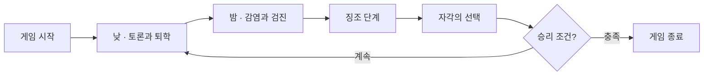

## 게임 개요

학교 괴담을 테마로 한 실시간 온라인 소셜 디덕션(마피아) 게임이다. 학교에 퍼진 저주를 둘러싼 심리전으로, 감염된 학생은 자신도 모르게 변해가다 깨어나 적이 되고, 감염은 매 라운드 번진다.

| 항목 | 내용 |
|------|------|
| 장르 | 소셜 디덕션 / 마피아 |
| 플랫폼 | 웹 우선 (디스코드 액티비티 병행 검토) |
| 인원 | 5~8명 실시간 온라인 (4인은 별도 캐주얼 모드) |
| 플레이 타임 | 10~20분 |
| 타겟 | 마피아·Among Us를 좋아하는 10~20대 친구 그룹 |
| 수익 모델 | 완전 F2P + 비확률형 코스메틱 + 시즌패스 |

> [!info] 본 피치는 설계 문서 v3 기준이다. 코어 메커니즘은 '감염 확산'이며, 지연 자각은 그 위의 텍스처로 재설계되었다.

## THE HOOK — 핵심 후크

학교 괴담이 현실이 된다. 칠판에 이름이 적히는 순간 저주가 시작되지만, 저주는 한 번에 드러나지 않는다. 감염된 학생은 미열과 환청, 흐릿한 글리치 같은 **징조**를 거쳐 서서히 깨어나며, 그동안 본인조차 자신이 일반 학생이라 믿는다.

> [!tip] 한 줄 후크: "넌 아직 네가 저주인 줄 모른다 — 그리고 네 편은 매 라운드 줄어든다."

핵심은 두 가지다. 첫째, 감염은 거짓말이 아니라 진짜 모르는 상태에서 시작된다. 둘째, 그 모르는 상태인 징조는 다른 플레이어가 사냥할 수 있는 상태다. 그래서 게임은 단순 추리가 아니라 감염 확산 대 징조 사냥의 레이스가 된다.

## 코어 게임플레이

게임의 무게중심은 감염이다. 적을 죽이는 것이 아니라 아군을 적으로 바꾼다. 내 편이 매 라운드 줄어드는 공포가 핵심 재미다.

### 게임 루프

### 핵심 메커니즘

- **감염 확산**: 킬이 아닌 감염으로 저주가 번지며, 어제의 아군이 오늘의 적이 된다
- **징조 단계**: 감염되면 즉시 뒤집히지 않고 1라운드의 징조 단계를 거치며, 본인은 불안만 느끼고 보건위원과 목격자는 이 상태를 사냥할 수 있다
- **자각의 선택**: 징조가 끝나는 순간 본인이 고른다. 받아들임은 즉시 저주가 되어 능력을 얻지만 신호를 남기고, 저항은 1라운드 알리바이를 사지만 1회 한정이며 이후 더 잘 들킨다
- **학교 역할 능력**: 보건위원의 3단계 검진(음성·징조·양성), 반장의 2표, 도서부원의 단서, 목격자의 밤 정보로 정보 비대칭과 추리 구조를 강화한다

## 게임 경험과 분위기

이 게임은 불안하고, 의심스럽고, 반전이 있으며, 친밀하고, 소름끼친다. 플레이어는 방금까지 같은 편이던 친구가 진짜 같은 편인지 확신할 수 없는, 서서히 무너지는 신뢰를 경험한다.

게임을 정의하는 순간은 이렇다. 어느 라운드의 끝, 화면이 글리치되며 칠판에 자신의 이름이 적히는 것을 본다. 그리고 받아들일지 저항할지 선택한다. 게임은 이 순간을 패배가 아니라 각성으로 연출한다.

> [!info] 무대는 방과 후 어두워진 학교다. 낮에는 따뜻한 교실에서 토론하고, 밤이 되면 푸른 톤의 복도에 칠판 긁는 소리가 울린다. 시스템 메시지는 괴담 일기장 스타일로 전달된다.

## 레퍼런스 게임과 차별점

| 레퍼런스 | 가져오는 것 | 우리의 변주 |
|----------|-------------|-------------|
| Among Us | 소셜 디덕션 코어 루프 | 미션 제거, 순수 토론·심리전에 감염 시스템 결합 |
| Werewolf / 마피아 | 낮-밤 페이즈, 투표 퇴학 | 징조 단계로 감염을 사냥 가능하게, 감염으로 진영 유동화 |
| Project Winter | 감염·배신 메커니즘 | 학교 테마와 역할 능력으로 정보 비대칭 강화 |

> 기존작들이 시작 시 정체를 통보하는 것과 달리, 칠판 위의 저주는 감염에서 징조, 자각으로 이어지는 점진적 전환을 코어로 삼아 추리의 결을 한 겹 더한다.

## 타겟과 시장 포지셔닝

- **1차 타겟**: 마피아와 Among Us를 좋아하는 10~20대 친구 그룹으로, 음성·텍스트 소통을 즐기는 층
- **2차 타겟**: 학교 괴담·호러 팬, 가벼운 심리 게임을 찾는 캐주얼 게이머
- **포지셔닝**: 마피아42만큼 깊지만 Among Us만큼 진입이 쉬운, 호러 테마의 10~20분 토론 게임

Among Us의 누가 범인인지 가려내는 재미를 원하지만 미션 반복이 지루했던 사람들에게, 순수 심리전과 나도 내 정체를 모르는 신선한 반전을 제공한다.

## 개발 범위와 기대 효과

- **MVP 콘텐츠**: 코어 게임모드 1개(5~8인), 역할 4종(반장·보건위원·도서부원·목격자), 괴담 이벤트 3종
- **팀 규모**: 소규모 팀 프로젝트
- **복잡도**: Medium 수준으로, 실시간 멀티플레이어와 상태 동기화가 필요하나 물리·그래픽 복잡도는 낮다

> [!warning] 최대 리스크는 콜드 스타트(5~8인 동시 매칭)와 실시간 멀티플레이어 기술 안정성이다. MVP 단계에서 봇 채우기와 안정성 검증을 최우선으로 다룬다.

> 지연 자각을 연출에서 게임성으로 끌어올린 v3 설계를 기반으로, 차별화된 소셜 디덕션 경험과 검증 가능한 MVP 게이트를 갖추고 개발에 착수할 것을 제안한다.
